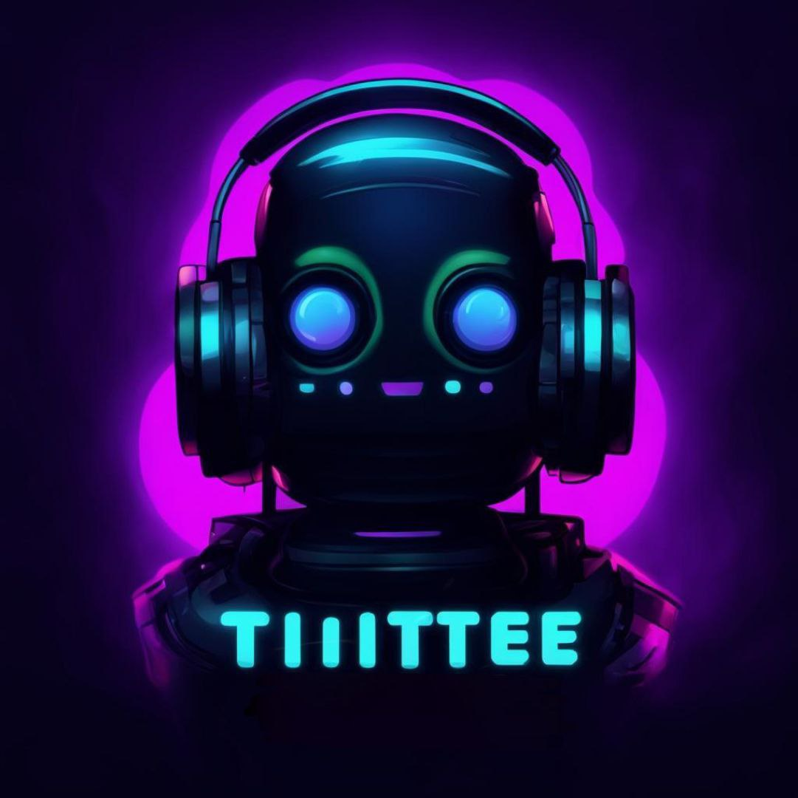

# Tilttee (Discord Music Bot)

 

Thanks to yt-dlp and ffmpeg, Tilttee plays audio from YouTube/Twitch/Yandex Music into your voice channel. 
- Use this [link](https://discord.com/api/oauth2/authorize?client_id=1175331860205805639&permissions=8&scope=bot) to invite my bot to your server (it can be turned off)
## 📝 Requirements
1. Discord Bot Token [Guide](https://discordjs.guide/preparations/setting-up-a-bot-application.html#creating-your-bot) 
2. Give Administrator permisson for bot
## ⚙️ Configuration:
1) Install the required libraries using requirements.txt
2) Insert your bot’s token into the .env file
3) If you want to use the Yandex Music service, replace the cookie.txt with yours (more on this below)
### 🎵 Support for Yandex Music
To use Yandex Music you need:
1) Go to the service [website](https://music.yandex.ru/home) and log in
2) Download the [extension](https://chromewebstore.google.com/detail/get-cookiestxt-locally/cclelndahbckbenkjhflpdbgdldlbecc?hl=ru&utm_source=ext_sidebar) to create a cookie file / get the cookie another way (Necessarily Netscape format)
3) Rename the resulting file to cookies.txt and replace the original file with the received one.
